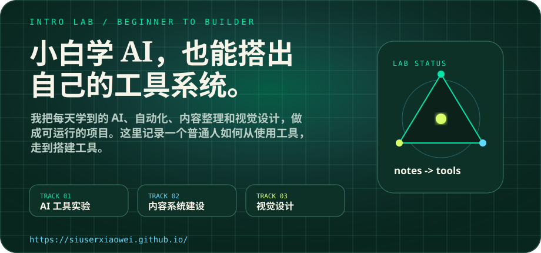
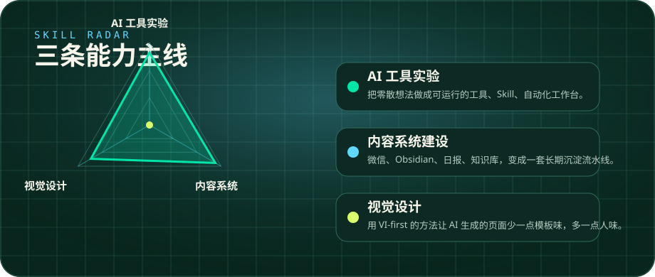
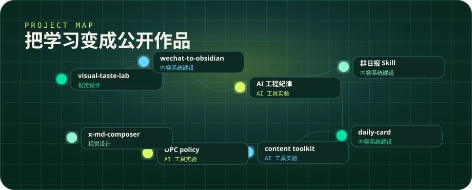
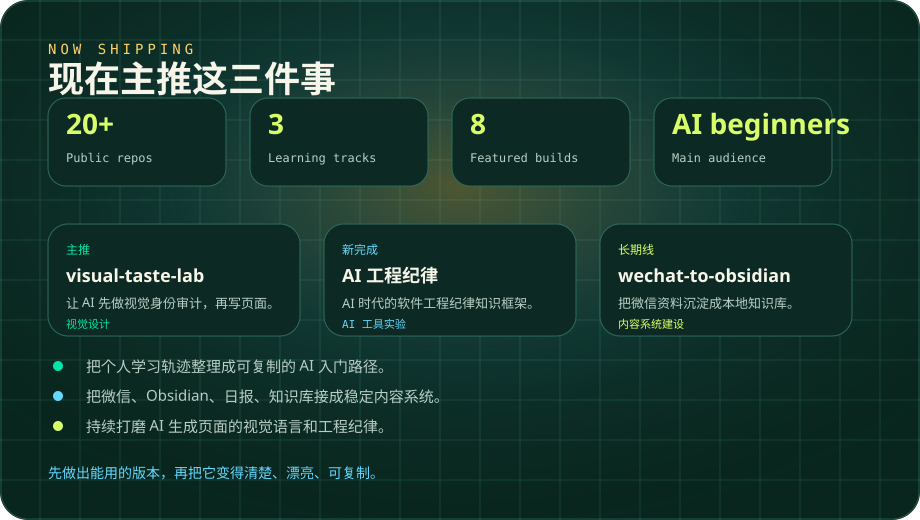

  

 

  

 

  

 

  

## Now Shipping

| Project | Why it matters | Links |
| --- | --- | --- |
| `visual-taste-lab` | 让 AI 先做视觉身份审计，再写页面，减少模板味。 | [Repo](https://github.com/siuserxiaowei/visual-taste-lab) · [Demo](https://siuserxiaowei.github.io/visual-taste-lab/) |
| `ai-coding-knowledge-framework` | 把 AI 编程背后的工程纪律整理成可阅读框架。 | [Repo](https://github.com/siuserxiaowei/ai-coding-knowledge-framework) · [Demo](https://siuserxiaowei.github.io/ai-coding-knowledge-framework/) |
| `wechat-to-obsidian` | 把微信里的资料沉淀成本地 Obsidian 知识库。 | [Repo](https://github.com/siuserxiaowei/wechat-to-obsidian) |

## Project Map

| 方向 | 我在练什么 | 代表项目 |
| --- | --- | --- |
| AI 工具实验 | Agent、Codex、自动化、工作台 | [ai-coding-knowledge-framework](https://github.com/siuserxiaowei/ai-coding-knowledge-framework), [content-creator-toolkit](https://github.com/siuserxiaowei/content-creator-toolkit) |
| 内容系统建设 | 微信、Obsidian、日报、知识库沉淀 | [wechat-to-obsidian](https://github.com/siuserxiaowei/wechat-to-obsidian), [daily-card-public](https://github.com/siuserxiaowei/daily-card-public) |
| 视觉设计 | VI-first、页面审美、信息卡片 | [visual-taste-lab](https://github.com/siuserxiaowei/visual-taste-lab), [x-md-composer](https://github.com/siuserxiaowei/x-md-composer) |

## More Builds

| Project | What it does | Links |
| --- | --- | --- |
| `wechat-daily-report-skill` | 微信群日报 Skill，输出聊天气泡 HTML 和长图报告。 | [Repo](https://github.com/siuserxiaowei/wechat-daily-report-skill) · [Demo](https://siuserxiaowei.github.io/wechat-daily-report-skill/) |
| `daily-card-public` | AI 学习卡片和话题摘要的公开输出。 | [Repo](https://github.com/siuserxiaowei/daily-card-public) · [Demo](https://siuserxiaowei.github.io/daily-card-public/) |
| `opc-policy` | 把全国 OPC 政策资料整理成可查询导航。 | [Repo](https://github.com/siuserxiaowei/opc-policy) · [Demo](https://siuserxiaowei.github.io/opc-policy/) |
| `x-md-composer` | 本地优先的 Markdown 到 X 长文/帖子串编辑器。 | [Repo](https://github.com/siuserxiaowei/x-md-composer) |

## 作品集入口

更完整的项目地图和学习路径在这里：  
[https://siuserxiaowei.github.io/](https://siuserxiaowei.github.io/)
