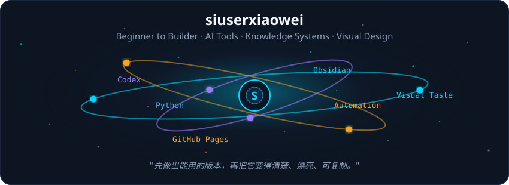
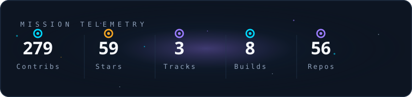
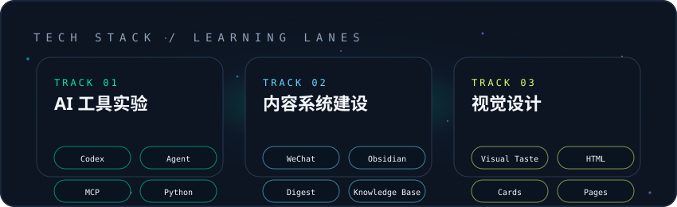
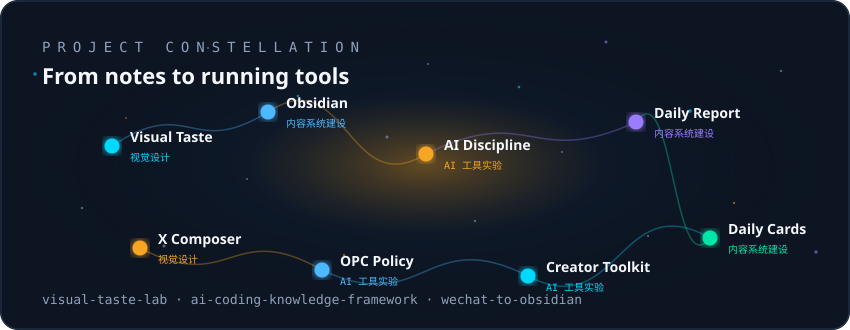

  

 

  

 

  

 

  

 

## Now Shipping

<table>
  <tr>
    <td width="50%" valign="top">
      <h3>visual-taste-lab</h3>
      
让 AI 先做视觉身份审计，再写页面，减少模板味。

      
<a href="https://github.com/siuserxiaowei/visual-taste-lab"><strong>Repo</strong></a> · <a href="https://siuserxiaowei.github.io/visual-taste-lab/">Live demo</a>

    </td>
    <td width="50%" valign="top">
      <h3>AI Coding Knowledge Framework</h3>
      
把 AI 编程背后的工程纪律整理成可阅读框架。

      
<a href="https://github.com/siuserxiaowei/ai-coding-knowledge-framework"><strong>Repo</strong></a> · <a href="https://siuserxiaowei.github.io/ai-coding-knowledge-framework/">Live demo</a>

    </td>
  </tr>
</table>

## Project Map

### AI Tools

- **[ai-coding-knowledge-framework](https://github.com/siuserxiaowei/ai-coding-knowledge-framework)** - AI 时代的软件工程纪律知识框架。
- **[content-creator-toolkit](https://github.com/siuserxiaowei/content-creator-toolkit)** - 多平台 KOL 监控与 AI 选题分析系统。
- **[opc-policy](https://github.com/siuserxiaowei/opc-policy)** - 全国 OPC 政策资料导航。

### Content Systems

- **[wechat-to-obsidian](https://github.com/siuserxiaowei/wechat-to-obsidian)** - 把微信资料沉淀成本地 Obsidian 知识库。
- **[daily-card-public](https://github.com/siuserxiaowei/daily-card-public)** - AI 学习卡片和话题摘要公开输出。
- **[wechat-daily-report-skill](https://github.com/siuserxiaowei/wechat-daily-report-skill)** - 微信群日报 Skill，输出 HTML 和长图报告。

### Visual Design

- **[visual-taste-lab](https://github.com/siuserxiaowei/visual-taste-lab)** - VI-first 视觉审美 Skill。
- **[x-md-composer](https://github.com/siuserxiaowei/x-md-composer)** - 本地优先的 Markdown 到 X 内容编辑器。

## Portfolio

更完整的项目地图和学习路径：
[https://siuserxiaowei.github.io/](https://siuserxiaowei.github.io/)
